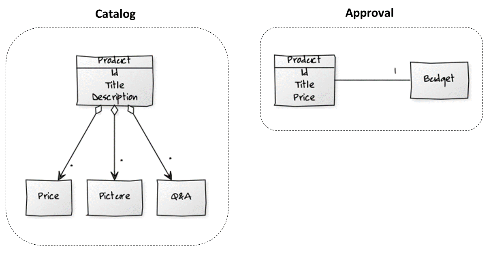
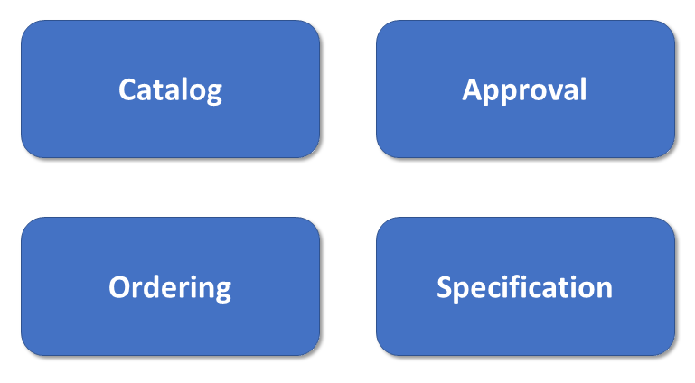
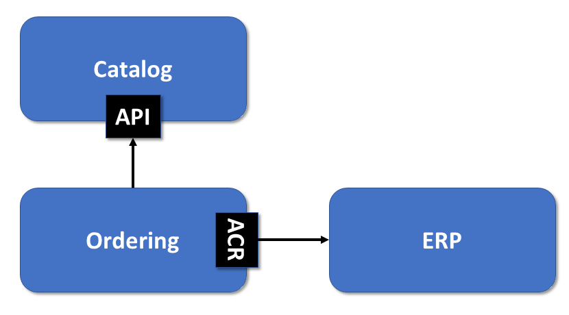
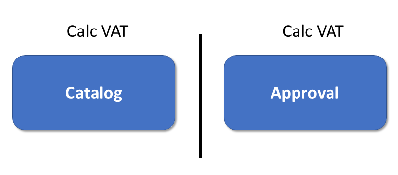

# Strategic Domain Driven Design

Monorepos allow huge enterprise applications to be subdivided into small and maintainable libraries. This is, however, only one side of the coin: First, we need to define criteria for slicing our application into individual parts. Also, we must establish rules for the communication between them. 

In this chapter, I present a methodology I'm using for subdividing big software systems into individual parts: It's called Strategic Design and it's part of the [domain driven design](https://www.amazon.de/Domain-Driven-Design-Tackling-Complexity-Software/dp/0321125215/ref=sr_1_3?ie=UTF8&qid=1551688461&sr=8-3&keywords=ddd) (DDD) approach. Also, I show how to implement its ideas with an [Nx](https://nx.dev/)-based monorepo.

## What's Domain Driven Design about?

DDD describes an approach that bridges the gap between requirements for complex software systems on the one hand and a appropriate application design on the other. It can be subdivided into the disciplines Tactical Design and Strategic Design. The former proposes concrete concepts and patterns for an object-oriented design respective architecture. It has an opinionated view on using OOP. As an alternative, there are approaches like [Functional Domain Modeling](https://pragprog.com/book/swdddf/domain-modeling-made-functional) that transfer the ideas behind it into the world of functional programming.

By contrast, strategic design deals with the breakdown of a large system into individual (sub-)domains and their design. No matter if you like DDD's opinionated view or not, some ideas from Strategic Design have proven to be useful for subdividing a system into smaller, self-contained parts. It is exactly these ideas that this chapter takes up and presents in the context of Angular. Whether the remaining aspects of DDD are also taken into consideration, however, is irrelevant for the chapter.

## Finding Domains with Strategic Design

One goal of Strategic Design is to identify self-contained domains. Such are recognizable by a specific vocabulary. Both domain experts and developers must rigorously use this vocabulary in order to prevents misunderstandings. As this language is also used within the code the application mirrors its domain and hence is more self-describing. DDD refers to this as the [ubiquitous language](https://martinfowler.com/bliki/UbiquitousLanguage.html).

Another characteristic of domains is that often one or a few groups of domain experts primarily interact with it.

To recognize domains, it is worth taking a look at the processes in the system. For example, an e-Procurement system that handles the procurement of office supplies could support the following two processes:

It is noticeable that the process steps `` Approve Order``, `` Request Budget`` and `` Approve Budget`` primarily revolve around organizational hierarchies and the available budget. In addition, managers are primarily involved here. By contrast, the process step is primarily about employees and products.

Of course, it can be argued that products are omnipresent in an e-Procurement system. However, a closer look reveals that the word ``product`` denotes different things in some of the process steps shown here. For example, while a product is very detailed when it is selected in the catalog, the approval process only needs to remember a few key data:

In the sense of the ubiquitous language that prevails within each domain, a distinction must be made between these two forms of a product. This leads to the creation of different models that are as concrete as possible and therefore meaningful.

At the same time, this approach prevents the creation of a single model that attempts to describe the entire world. Such models are often confusing and ambiguous. In addition, they have too many interdependencies that make decoupling and subdividing impossible.

At a logical level, the individual views of the product may still be related. If this is expressed by the same id on both sides, this works without technical dependencies.

Thus, each model is valid only within a certain scope. DDD also calls this the [bounded context](https://martinfowler.com/bliki/BoundedContext.html). Ideally, each domain has its own bound context. As the next section shows, however, this goal can not always be achieved when integrating third-party systems.

If we proceed with this kind of analysis we might come up with the following domains:

If you like the shown process oriented approach of identifying different domains alongside the vocabulary (entities) and groups of domain experts, you might love [Event Storming](https://www.eventstorming.com). This is a workshop format where several domain experts analyze business domains together. 

## Context-Mapping

Although the individual domains are as self-contained as possible, they still have to interact from time to time. In the example considered here, the ``ordering`` domain for sending orders could access both the ``catalog`` domain and a connected ERP system:

The way these domains interact with each other is determined by a context map. In principle, 
``Ordering`` and `` Booking`` could share the common model elements. In this case, however, care must be taken to ensure that one modification does not entail inconsistencies on the other.

One domain could easily use the other. In this case, however, the question arises as to who in this interaction is entitled to how much power. Can the consumer impose certain changes on the provider and insist on backward compatibility? Or does the consumer have to be satisfied with what it gets from the provider?

In the case under consideration, Catalog offers an API to prevent changes in the domain from forcibly affecting consumers. Since ordering has little impact on the ERP system, it uses an anti-corruption layer (ACR) for access. If something changes in the ERP system, it only has to update it. In addition, Strategic Design defines further strategies for the relationship between consumers and providers.

An existing system like the shown ERP system does normally not follow the idea of the bounded context. Rather, it contains several logical and intermingled sub-domains. 

Another possible strategy I want to stress out here is ``Separate Ways``, which means that a specific aspect like calculating the VAT is separately implemented in several domains:

At first sight this seems to be awkward, especially because it leads to code redundancies and hence breaks the DRY principle (don't repeat yourself). Nevertheless, in some situations it comes in handy because it prevents a dependency to a shared library. While preventing redundant code is an important goal preventing dependencies is as well vital. The reason is that each dependency also defines a contract and contracts are hard to change. Hence, it's a good idea to evaluate whether an additional dependency is worth it.  

As above mentioned, each domain should have its own bounded context. The example shown here contains an exception: If we have to respect an existing system like the ERP system it might contain

## Conclusion

Strategic Design is about identifying self-contained (sub-)domains. In each domain we find an ubiquitous language and concepts that only make sense within the domain's bounded context. A context map shows how those domains interact with each other. 

In the next chapter we'll see we can implement those domains with an Angular using an [Nx](https://nx.dev/)-based monorepo.
