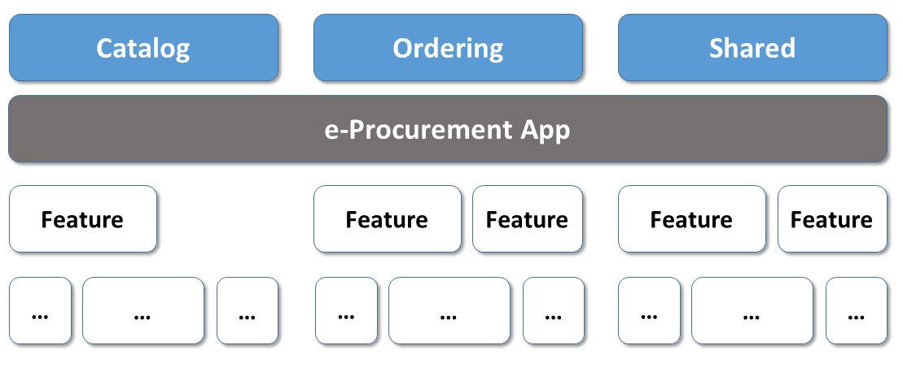
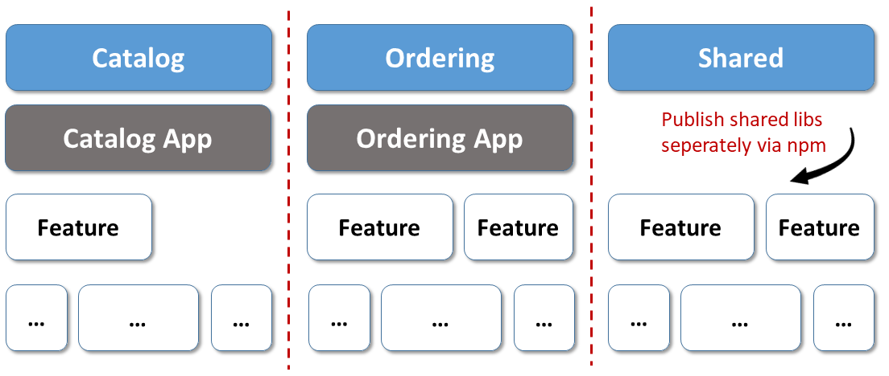
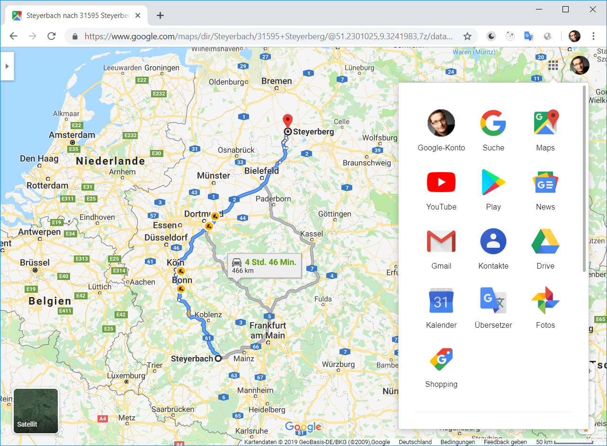
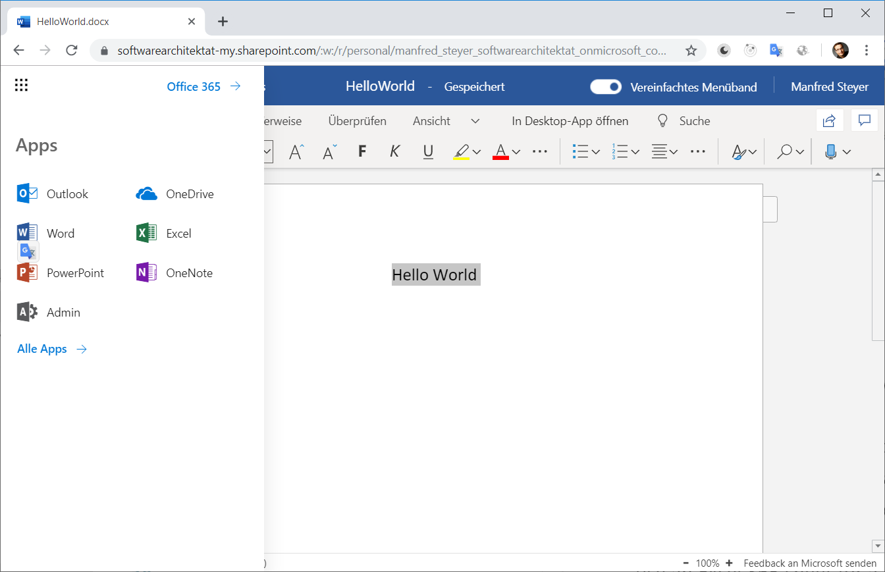
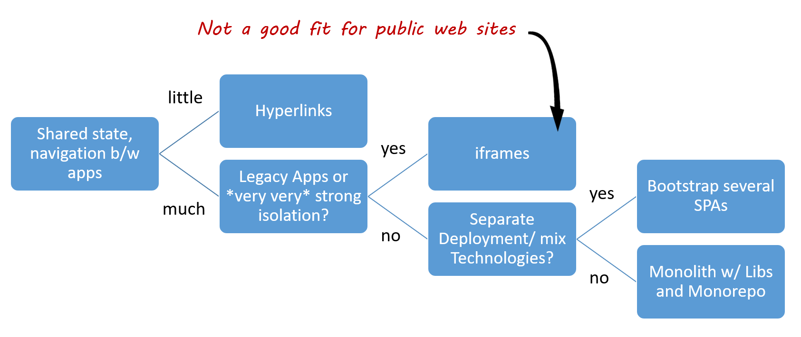

# From Domains to Micro Frontends

Let's assume, you've identified the sub-domains for your system. The next question is, how to implement them. 

One option is to implement them within a big application -- aka a deployment monolith -- and the second one is about providing a separate application for each domain. 

Such applications are nowadays called micro frontends.

## Deployment Monoliths

A deployment monolith is a big integrated solution containing different domains:



This approach supports a consistent UI and leads to optimized bundles as everything is compiled together. 

On the other side, a team responsible for one sub-domain needs to coordinate with other teams responsible for other sub-domains. They have to agree on an overall architecture, the leading framework, and an update policy for dependencies. Interestingly, you might also see this as an advantage.

Also, it is tempting to just reuse parts of other domains which may lead to higher coupling and -- sooner or later -- to breaking changes. To prevent this situation, you can go with free tools like [Nrwl's Nx](https://nx.dev/angular). For instance, Nx allows to define access restrictions between the parts of your mono repo to enforce your envisioned architecture and loosely coupling.

## Deployment monoliths, micro frontends or something in between?

To further decouple the parts of your system, you could decide to split it into several smaller applications. If we assume that use cases are not overlapping the boundaries of your sub-domains, this can lead to more autarkic teams and applications which can be deployed separately.

.

Also, as we are having several tiny systems now, it decreases the complexity.

If you seek even more isolation between your sub-domains and teams responsible for them, you could decide to put each sub-domain into a (mono) repository of its own:



Now, you have something people are calling micro frontends nowadays. This allows the individual teams to be as autarkik as possible: They can choose for their own architectural style, their own technology stack and they can even decide by themselves when to update to newer versions of the frameworks used. This also means they can use "the best technology" for the requirements given within the current sub-domain. 

To possibility to use their own framework and architecture comes in handy for applications which are developed in long term. If, for instance, a new framework shows up in five years, we can just use it for implementing the next domain.

However, this does not come without costs: Now you have to deal with shipping your shared libraries via npm and this includes versioning which can lead to version conflicts. 

## UI Composition with Hyperlinks

Also, you have to find ways to integrate the different applications to one big system which is presented to your users. One easy way to accomplish this is using hyperlinks:



This approach seems to fit quite well for product suites like Google or Office 365:



Here, each domain is a self contained application. This worked quite well, because we don't need much interactions between the domains. If we needed to share data, we can use the backend. Using this strategy, Word 365 can use an Excel 365 sheet for a series letter.

This approach has several advantages:

- It is easy
- It uses SPA frameworks as intended
- We get optimized bundles per domain

However, there are also some disadvantages:

- We loose our state when switching to another application
- We have to load another application -- this is what we wanted to prevent with SPAs
- We have to make sure to get a common look and feel (we need a common design system).

## UI Composition with a Shell

Another approach discussed a lot nowadays is providing a shell that loads different single page applications on demand:


In the shown screenshot, the shell loads the micro frontend with the red border into its working area. Technically, it just loads the micro frontends bundles on demand. After this, the shell creates an element for the micro frontend's root element:

```javascript
const script = document.createElement('script');
script.src = 'assets/external-dashboard-tile.bundle.js';
document.body.appendChild(script);

const clientA = document.createElement('client-a');
clientA['visible'] = true;
document.body.appendChild(clientA);
```

Instead of bootstrapping several SPAs we could also use iframes. While we all know the huge disadvantages of iframes as well as strategies to deal with most of them, they provide two useful features here:

1) Isolation: An micro frontend in one iframe cannot influence or hack another microfrontend in another iframe. Hence, they come inhandy for plugin systems or when integrating applications from other vendors.
2) They also allow to integrate legacy systems.

A library that compensates most of the disadvantages of iframes for intranet applications can be found [here](https://www.npmjs.com/package/@microfrontend/common).

The shell approach comes with the following advantages:

- The user gets an integrated solution which consists of different micro frontends.
- We don't loose state when navigating between domains.

The disadvantages are:

- If we don't use specific tricks (outlined in the next chapter), each micro frontend comes with its own copy of Angular and the other frameworks. This increases the bundle sizes.
- We have to implement some infrastructure code for loading micro frontends and switching between them. 
- Also here, we have to make sure to get a common look and feel (we need a common design system).

## Finding a Solution

Deciding between a deployment monolith and different approaches for micro frontends is quite difficult because each option comes with its very own advantages and disadvantages. 

To provide some guidance I've created the following decision tree which also sums up the ideas outlined in this chapter:



As the implementation of a deployment monolith and the hyperlink approach is obvious, the next chapter discusses how to implement a shell.

## Conclusion

There are several ways for implementing micro frontends and all of them come with their very own advantages and disadvantages. Also, using a consistent and optimized deployment monolith can also be the right choice. 

At the end of the day, it's about knowing your architectural goals and about evaluating them against the positive and negative consequences of  architectural candidates available for your needs.